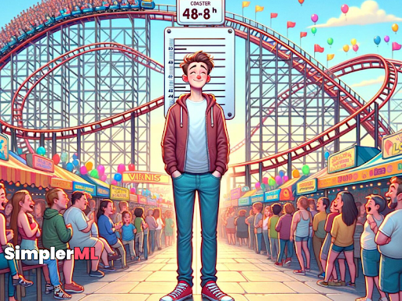

# The Threshold 📏

Remember I told you we're going to discuss the threshold? Let's do it now before we move on to a more complex example.

Let’s Understand Threshold Using an Everyday Analogy:

**The Amusement Park Ride**

Imagine you’re at an amusement park, and there’s a viral roller coaster ride. However, to ensure safety, you must be at least 48 inches tall to ride.

Imagine you’re at an amusement park, and there’s a viral roller coaster ride. However, to ensure safety, you must be at least 48 inches tall to ride.

**1. Why the Height Requirement? (Objective)**

Just like the roller coaster has a height requirement for safety, in our social media example, we set a threshold to decide if a post will be viral. It’s a kind of “safety check” to ensure our prediction (whether a post is viral or not) meets a certain standard.

**2. How Tall Are Most People? (Data Distribution)**

If most visitors are taller than 48 inches, many will get to ride. If many are shorter, fewer will. Similarly, in our example, we look at our data (posts) and see how many would be considered viral. This helps us decide where to set the threshold.

**3. Avoiding Disappointment (Performance Metrics)**

The park doesn’t want to disappoint too many kids or compromise safety. We also don’t want to label too many posts as viral when they’re not or miss out on truly viral ones.

**4. Testing the Height Stick (Cross-Validation)**

Sometimes, the park tests the height stick at different spots to make sure it works well for all kids, not just a few. Similarly, we test our threshold across different sets of posts to ensure it works well overall.

**5. Adjusting as Kids Grow (Iterative Approach)**

As kids grow, the park might adjust the height requirement. Similarly, as we get more data on posts, we might adjust our threshold to be more accurate.

**6. Special Days (External Factors)**

On a ‘kids day,’ the park might lower the requirement slightly to let more kids enjoy themselves. On social media, if there’s a special event or trend, we might adjust our threshold to reflect that.

I hope this journey helped you understand how you can set a threshold!

Ok, we are back now after a scary roller coaster ride. Let’s level up with more complex scenarios!
